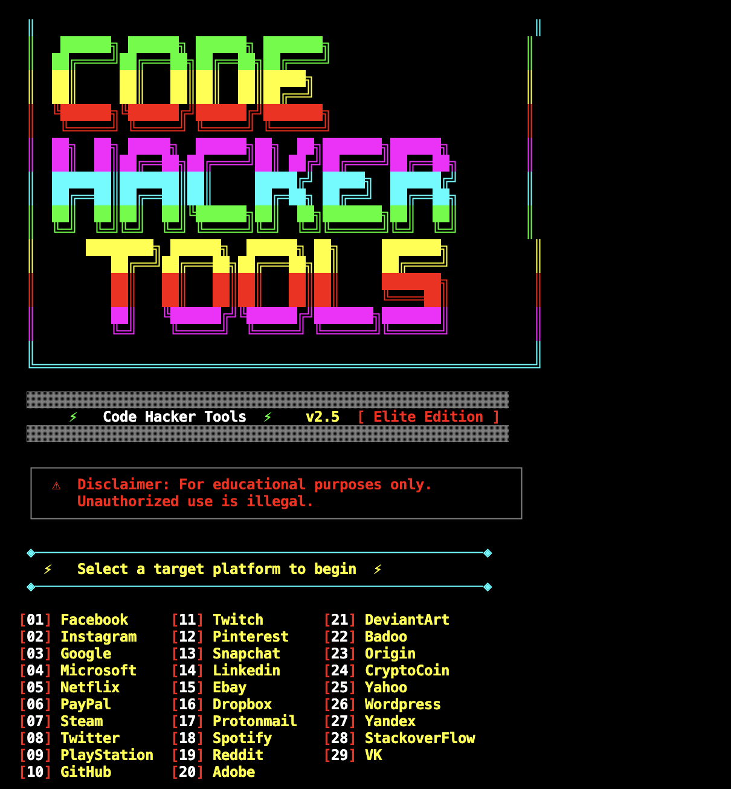

# CodeHackerTools v2.5

> A powerful terminal-based tool with stylish hacker UI — supports 29 platforms with Ngrok, Serveo & Localhost tunneling.



---

## Requirements
- `git`
- `php`
- `curl`
- `unzip`
- `ngrok` (auto-configured on first run)

---

## List of Available Sites
```
[01] Facebook     [11] Twitch       [21] DeviantArt
[02] Instagram    [12] Pinterest    [22] Badoo
[03] Google       [13] Snapchat     [23] Origin
[04] Microsoft    [14] Linkedin     [24] CryptoCoin
[05] Netflix      [15] Ebay         [25] Yahoo
[06] PayPal       [16] Dropbox      [26] Wordpress
[07] Steam        [17] Protonmail   [27] Yandex
[08] Twitter      [18] Spotify      [28] StackoverFlow
[09] PlayStation  [19] Reddit       [29] VK
[10] GitHub       [20] Adobe
```

---

## Installation

### Termux (Android)
```bash
pkg update && pkg upgrade -y
pkg install git php curl unzip wget -y
git clone https://github.com/anuj7052/CodeHackerTools
cd CodeHackerTools
chmod +x codehackertools.sh
bash codehackertools.sh
```

### Kali Linux / Ubuntu / Debian
```bash
sudo apt update && sudo apt upgrade -y
sudo apt install git php curl unzip wget -y
git clone https://github.com/anuj7052/CodeHackerTools
cd CodeHackerTools
chmod +x codehackertools.sh
bash codehackertools.sh
```

### macOS (with Homebrew)
```bash
brew update
brew install git php curl unzip wget ngrok
git clone https://github.com/anuj7052/CodeHackerTools
cd CodeHackerTools
chmod +x codehackertools.sh
bash codehackertools.sh
```

---

## Ngrok Setup
Ngrok is used to expose the local server publicly.  
On **first run**, the tool will automatically ask for your authtoken if not already configured.

1. Sign up free at [https://dashboard.ngrok.com](https://dashboard.ngrok.com)
2. Copy your authtoken from [https://dashboard.ngrok.com/authtokens](https://dashboard.ngrok.com/authtokens)
3. Paste it when prompted — it gets saved automatically for future use

---

## Port Forwarding Options
```
[01] LocalHost       — Test locally on your machine
[02] Ngrok.io        — Public URL via Ngrok tunnel
[03] Serveo.net      — Public URL via SSH tunnel
[04] Localhost.run   — Public URL via localhost.run
```

---

## Features
- Stylish block-letter ASCII banner (Code Hacker Tools)
- Multi-color terminal UI
- Auto Ngrok authtoken setup on first run
- 29 platform templates
- IP & credential capture
- Works on Termux, Kali Linux, and macOS

---

## How to Update
```bash
cd CodeHackerTools
bash update.sh
```

---

## Legal Disclaimer

> **This tool is made strictly for educational and research purposes.**  
> It is intended to help students and cybersecurity learners understand how phishing attacks work — so they can **defend against them**.

- Do **NOT** use this tool on any person or system without their **explicit written consent**
- Unauthorized use is a **criminal offence** under IT laws in India and internationally
- The developer assumes **zero liability** for any misuse or damage caused
- **You are fully responsible** for your own actions

*Learn ethical hacking the right way — understand attacks to build better defenses.*

---

## Learn Ethical Hacking & Cybersecurity

> **Want to master Ethical Hacking, Python, and Web Development?**

### 🎓 ONLY4YOU Academy — India's #1 Affordable Learning Platform

| Platform | Link |
|---|---|
| 🌐 Website | [only4you-app.vercel.app](https://only4you-app.vercel.app/) |
| 📚 Free Hacking Blogs | [only4you-app.vercel.app/blogs](https://only4you-app.vercel.app/blogs) |
| 🎯 All Courses | [only4you-app.vercel.app/courses](https://only4you-app.vercel.app/courses) |
| 📖 Learn & Study | [learn.microsoftupdates.co.in](https://learn.microsoftupdates.co.in) |

### Connect & Follow

| Platform | Link |
|---|---|
| ▶️ YouTube | [YouTube Channel](https://www.youtube.com/channel/UC60jSLiBfFBwix1gfKZZIKg) |
| 📸 Instagram | [@its_anujsinghh](https://www.instagram.com/its_anujsinghh/) |
| 💼 LinkedIn | [Anuj Singh](https://www.linkedin.com/in/anuj-singh-46140116a/) |
| 💬 WhatsApp Channel | [Join Now](https://whatsapp.com/channel/0029VbBhxP089inhES7SiZ2X) |

> *20+ Masterclasses • 300+ Lessons • Azure AI Assistant • Just ₹99/Year*  
> *Made with ❤️ in India*


